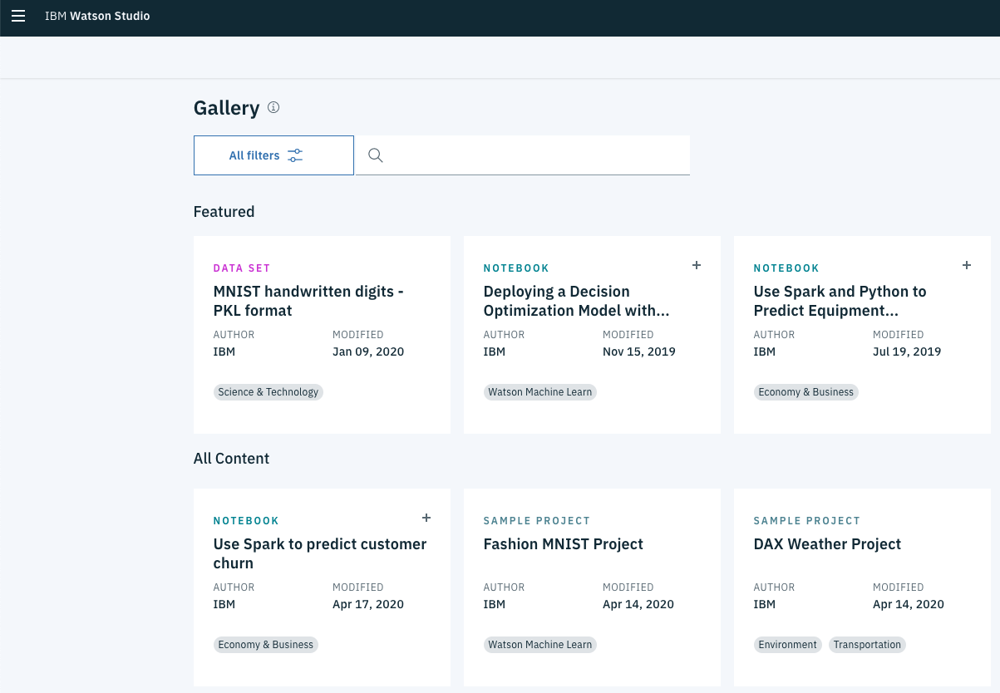

# recommendations_with_IBM
DSND Term 2 Project: Recommendations with IBM

### Table of Contents

1. [Installation](#installation)
2. [Project Motivation](#motivation)
3. [File Descriptions](#description)
4. [Acknowledgements](#acknowledgement)

### Installation 

The code should run with no issues using Python versions 3.*. If you use Anaconda, please make sure install below libraries:

1. nltk
2. re

You will also need to have software installed to run and execute an iPython Notebook.

### Project Motivation
For this project I will analyze the interactions that users have with articles on the IBM Watson Studio platform, and make recommendations to them about new articles the model predict they will like. 

Below is an example of what the dashboard look like and articles displayed on the IBM Watson Platform.

In this project, I will build and assess various recommendation approaches:

1. Rank Based Recommendations
2. User-User Based Collaborative Filtering
3. Content Based Recommendations
4. SVD (Matrix Factorization)

### File Descriptions
1. **Recommendations_with_IBM.ipynb** - Recommendation models
2. **project_tests.py** - Recommendation result tests
3. **user_item_matrix.p** - user-item interaction matrix for singular value decomposition.

### Acknowledgements
Credit to **IBM** and **Udacity** for the data.
